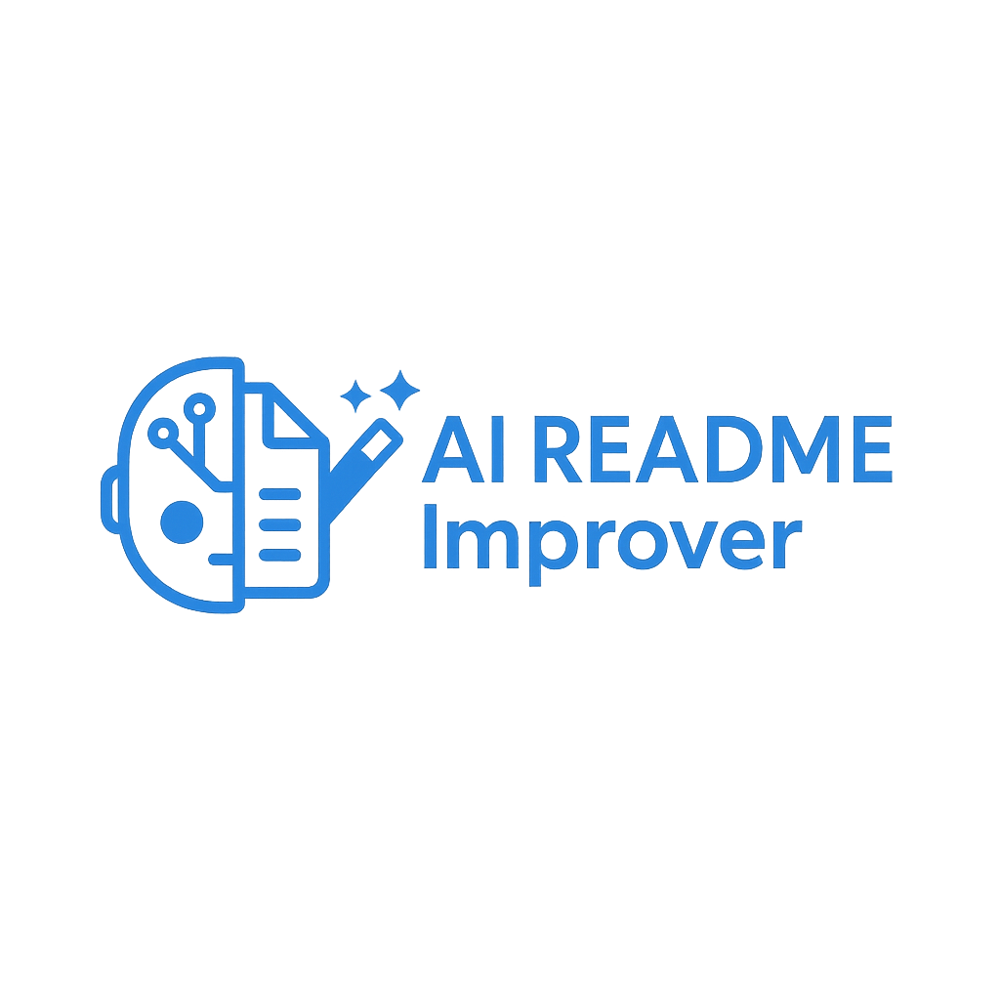

# AI README Improver



[](https://github.com/habib13352/ai-readme-improver/actions) [](LICENSE)

## Table of Contents

- [Demo](#demo)
- [Installation](#installation)
- [Usage](#usage)
- [Features](#features)
- [Configuration](#configuration)
- [Contributing](#contributing)
- [License](#license)
- [Maintainers](#maintainers)
- [Acknowledgements](#acknowledgements)
- [Contact](#contact)

```markdown
## Demo


In this demo, the user can see how the CLI tool automatically improves a README file by adding badges, a table of contents, and formatting the content for better readability.
```

## Installation

```bash
pip install ai-readme-improver
```

## Usage

```bash
ai-readme-improver --config config.yaml --archive-dir oldreadme --logo logo.png --email example@example.com
```

Briefly explain:
- `--config`: Specifies the path to a custom configuration file (config.yaml) for the AI readme improver.
- `--archive-dir`: Sets the directory (oldreadme) where old files will be archived.
- `--logo`: Indicates the logo image (logo.png) to be used in the readme.
- `--email`: Specifies the email address (example@example.com) to be displayed in the readme.

## Features
- 📚 Archives previous README and suggestions
- 📝 Generates TL;DR summaries, suggestions, and full rewrites
- ⚙️ Configurable via config.yaml
- 🤖 GitHub Action integration
- 🔄 Commits only on real changes

## Configuration

| Key            | Description                                     | Default    |
|----------------|-------------------------------------------------|------------|
| project_name   | Name of the project                             | None       |
| logo_path      | Path to the project logo                        | None       |
| email          | Contact email for the project                   | None       |
| badges         | List of badges to display on the project page   | None       |
| extra_sections | Additional sections to include in the project   | None       |

```markdown
## Contributing

Contributions are welcome! Please read [CONTRIBUTING.md](CONTRIBUTING.md) for guidelines on:
- Reporting bugs
- Submitting pull requests
- Writing tests
```

```markdown
## License

This project is licensed under the MIT License — see the [LICENSE](LICENSE) file for details.
```

## Maintainers
- John Smith (@johnsmith)
- Sarah Lee (@sarahlee)
- Alex Johnson (@alexjohnson)

## Acknowledgements

- The OpenAI team for their dedication and hard work in developing this project.
- Our community contributors for their valuable feedback and support throughout the process.
- Our mentors and advisors for their guidance and expertise.
- Our friends and family for their unwavering support and encouragement.

```markdown
## Contact

- Email: hamzahabib10@gmail.com
```